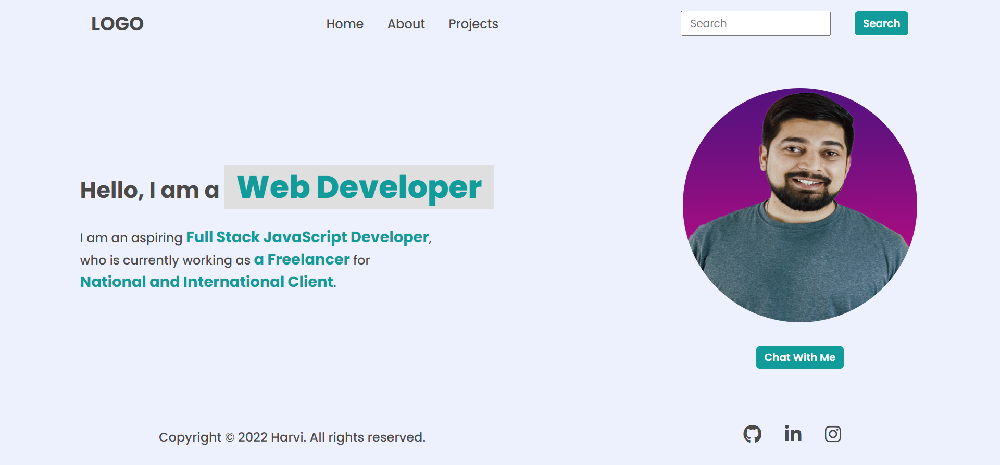
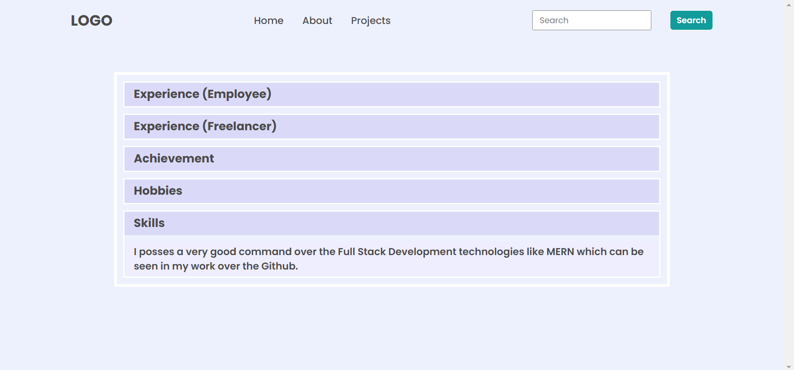

# **DOM Assignment 1**
>**Note**: To complete all the given task on the home page of the website.

## **Initial Output**


## Tech Stack


---

## **Task 1**

To append a new element in the navigation menu named **"Hire Me" after the **Contact**.

### **After Update**


### **Project Solution**

```
const mynewlist = document.createElement("li");
mynewlist.innerHTML = "<a>Hire Me</a>";
const element = document.querySelector("nav ul");
element.appendChild(mynewlist);
```

---

## **Task 2**

To change the placeholder message message to "Search My Project" from "Search".

### **After Update**


### **Project Solution**

```
const element2 = document.querySelector(".search-field input");
element2.setAttribute("placeholder", "Search My Project");
```

---

## **Task 3**

To change the "a Freelance" to "an Employee" and "National and International Client" to "iNeuron Intelligence Pvt Ltd".

### **After Update**


### **Project Solution**

```
const element3 = document.querySelector(".hero-left-section p span:nth-of-type(2)");
element3.textContent = "an Employee"; 

const element4 = document.querySelector(".hero-left-section p span:last-child");
element4.textContent = "iNeuron Intelligence Pvt Ltd";
```

---

## **Task 4**

To change the "Avatar" image with the image of "Hitesh Choudhary".

### **After Update**



### **Project Solution**

```
const element5 = document.querySelector(".hero-right-section img");
element5.setAttribute("src", "./person-image.jpg");
```

---

## **Task 5**

To create one more button name "Support Me" and add it next to the "Chat With Me" button below the avatar.

### **After Update**


### **Project Solution**

```
const mynewbutton = document.createElement("button");
mynewbutton.textContent = "Support Me";
const element6 = document.querySelector(".hero-right-section-btns");
element6.appendChild(mynewbutton);
```

---

# **DOM Assignment 2**

## **Task 1**

To change the color of heading and paragraph of the accordian with the given color codes.
For Heading: #dadaf8
For Paragraph: #eeeeff

### **After Update**


### **Project Solution**

```
const heading = document.querySelectorAll(".accordian h3");
for (let i = 0; i < heading.length; i++){
  heading[i].style.backgroundColor = "#dadaf8";
}
const paragraph = document.querySelectorAll(".accordian p");
for (let i = 0; i < paragraph.length; i++){
  paragraph[i].style.backgroundColor = "#eeeeff";
}
```

---

## **Task 2**

To add a new accordian at the bottom, similar to the output image. Also, to write javascript code for the added accordian, so that the card can be shown or being hide by the user click. After this change the heading and paragraph color again.

### **After Update**



### **Project Solution**

```
const myAccordian = `
<h3>Skills</h3>
<p>I posses a very good command over the Full Stack Development technologies like MERN which can be seen in my work over the Github.</p>
`;
const myNewDiv = document.createElement("div");
myNewDiv.className = "accordian";
myNewDiv.innerHTML = myAccordian;
const element = document.querySelector(".accordian-wrapper");
element.appendChild(myNewDiv);

let accordian = document.querySelectorAll(".accordian h3");
accordian.forEach((element) => {
  element.addEventListener("click", () => {
    let para = element.nextElementSibling;
    if (para.style.display === "block") {
      para.style.display = "none";
    } else {
      para.style.display = "block";
    }
  });
});

const heading = document.querySelectorAll(".accordian h3");
for (let i = 0; i < heading.length; i++){
  heading[i].style.backgroundColor = "#dadaf8";
}
const paragraph = document.querySelectorAll(".accordian p");
for (let i = 0; i < paragraph.length; i++){
  paragraph[i].style.backgroundColor = "#eeeeff";
}
```

---

# **DOM Assignment 3**

## **Task 1**

To add event listener over the second form (User Input Board), so that we can collect ala the data of second form when the user submit it. After collecting the data from the second form, we have to display that data in the first form (User Output Board) through the console.

### **After Update**


### **Project Solution**

```
let myForm = document.querySelectorAll("form");
myForm[1].addEventListener('submit', (event) => {
    event.preventDefault();
    // Below code will give the data entered by user
    let name = document.querySelector(".userName");
    let email = document.querySelector(".userEmail");
    let message = document.querySelector(".userMessage");

    // Below code will set the entered data in the User Output Board
    let sName = document.querySelector(".enterName");
    let sEmail = document.querySelector(".enterMail");
    let sMessage = document.querySelector(".enterMessage");

    sName.value = name.value;
    sEmail.value = email.value;
    sMessage.value = message.value;
})
```

---